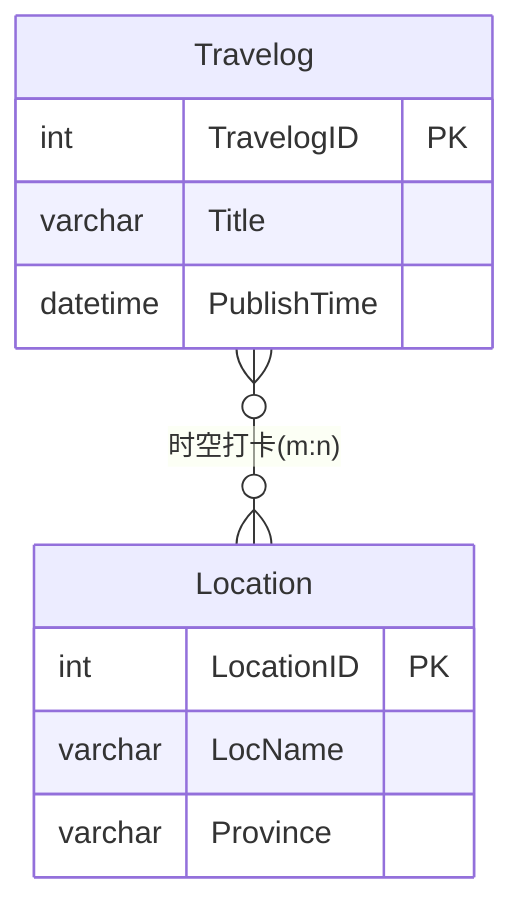

# 徐霞客时空游记系统 — 概念结构设计

**文档编号**：02  
**版本**：V1.0  
**编写日期**：2026-05-26  
**前置文档**：`01_需求分析报告.md`  
**项目名称**：徐霞客时空游记系统（Xu Xiake Spatiotemporal Travel Journal System）

---

## 1. 设计说明

概念结构设计处于需求分析之后、逻辑结构设计之前，采用 **E-R 模型（Entity-Relationship Model）** 描述现实世界的数据对象及其联系，与具体 DBMS 无关。本文档完成以下工作：

1. 界定五个核心**实体（Entity）**及其属性；
2. 分析实体间 **1 : n** 与 **m : n** 联系及基数约束；
3. 使用 **Mermaid `erDiagram`** 绘制全局 E-R 图；
4. 说明多对多联系的**联系属性**与桥表化思路，为逻辑模式转换做准备。

**符号约定**（与 Mermaid 及课程惯例对齐）：

| 符号 | 含义 |
| ---- | ---- |
| 矩形框 / `erDiagram` 实体块 | 实体 |
| 椭圆（文中列举） | 属性；下划线或 PK 标注为主键 |
| 菱形（文中描述） | 联系；旁注 1、n、m 表示基数 |
| `||--o{` | 一端必选、多端可选（1 : n） |
| `}o--o{` | 两端均可多（m : n，概念层） |

---

## 2. 实体与属性定义

### 2.1 实体：用户（User）

| 属性名 | 说明 | 键类型 |
| ------ | ---- | ------ |
| UserID | 用户唯一编号 | **主属性（主键）** |
| Username | 登录用户名 | 候选键（唯一） |
| Password | 加密密码 | 普通属性 |
| AvatarPath | 头像存储路径 | 普通属性 |
| RegisterDate | 注册日期 | 普通属性 |
| Bio | 个人简介 | 普通属性 |

**实体语义**：平台注册的现代游客，是游记的发布主体。

---

### 2.2 实体：景点（Location）

| 属性名 | 说明 | 键类型 |
| ------ | ---- | ------ |
| LocationID | 景点唯一编号 | **主键** |
| LocName | 景点名称 | 普通属性 |
| Province | 所属省份 | 普通属性 |
| OpeningHours | 开放时间 | 普通属性 |
| IsXuXiake | 是否徐霞客足迹 | 普通属性 |
| Description | 景点描述 | 普通属性 |

**实体语义**：可被浏览、打卡的旅游文化地点，可挂载古籍文献。

---

### 2.3 实体：文献（Literature）

| 属性名 | 说明 | 键类型 |
| ------ | ---- | ------ |
| LitID | 文献唯一编号 | **主键** |
| LocationID | 所属景点编号 | 外键属性（概念上归属 Location） |
| OriginalText | 原文 | 普通属性 |
| TranslateInfo | 译注 | 普通属性 |
| WriteDate | 成文年代 | 普通属性 |

**实体语义**：依附于某一景点的历史文献或游记摘录，不可独立存在而无景点归属。

---

### 2.4 实体：游记（Travelog）

| 属性名 | 说明 | 键类型 |
| ------ | ---- | ------ |
| TravelogID | 游记唯一编号 | **主键** |
| UserID | 发布者编号 | 外键属性（概念上归属 User） |
| Title | 标题 | 普通属性 |
| Content | 正文 | 普通属性 |
| PublishTime | 发布时间 | 普通属性 |
| Likes | 点赞数 | 普通属性 |

**实体语义**：用户发布的游记作品；与景点的「打卡」关系在概念上为多对多，逻辑上通过桥表实现。

---

### 2.5 实体：游记景点打卡关联（Travelog_Location）

本实体在概念层既可视为 **消解 m : n 的关联实体（Associative Entity）**，也可视为联系「时空打卡」的**逻辑对象化**结果。其属性如下：

| 属性名 | 说明 | 键类型 |
| ------ | ---- | ------ |
| TravelogID | 游记编号 | **联合主键之一**；外键 → Travelog |
| LocationID | 景点编号 | **联合主键之一**；外键 → Location |
| CheckInTime | 时空打卡时间 | 普通属性（联系衍生属性） |

**实体语义**：记录「哪篇游记在哪个景点、何时打卡」；同一 `(TravelogID, LocationID)` 组合唯一。

---

## 3. 实体间联系分析

### 3.1 联系一：用户 — 发布 — 游记（1 : n）

| 项目 | 内容 |
| ---- | ---- |
| 联系名 | **发布**（Publishes） |
| 参与实体 | User（1 端）、Travelog（n 端） |
| 基数 | **1 : n**（一个用户可发布多篇游记；一篇游记有且仅有一个发布者） |
| 存在依赖 | 游记依赖于用户存在；无用户的「孤立游记」在业务上不成立 |
| 实现策略 | 在游记实体中加入外键属性 `UserID` |

**实例说明**：用户「林青」可发布《滇游日记》《浙闽考察记》两篇游记；每篇游记的 `UserID` 均指向「林青」。

---

### 3.2 联系二：景点 — 包含 — 文献（1 : n）

| 项目 | 内容 |
| ---- | ---- |
| 联系名 | **包含**（Contains） |
| 参与实体 | Location（1 端）、Literature（n 端） |
| 基数 | **1 : n**（一个景点可有多条文献；一条文献仅属于一个景点） |
| 存在依赖 | 文献依赖于景点；删除景点则其文献失去归属（物理层采用级联删除） |
| 实现策略 | 在文献实体中加入外键属性 `LocationID` |

**实例说明**：「金鸡山」景点可关联《徐霞客游记·闽游日记》多条摘录；每条文献记录的 `LocationID` 相同。

---

### 3.3 联系三：游记 — 时空打卡 — 景点（m : n）★ 核心

| 项目 | 内容 |
| ---- | ---- |
| 联系名 | **时空打卡**（Check-In） |
| 参与实体 | Travelog、Location |
| 基数 | **m : n** |
| 联系属性 | **CheckInTime**（打卡时间，依赖于具体的「游记—景点」配对） |
| 业务规则 | 一篇游记可打卡多个景点；一个景点可被多篇游记打卡 |
| 实现策略 | **不可**在 Travelog 或 Location 任一侧用单外键表达；须引入关联实体 `Travelog_Location`，将 m : n 拆解为两个 **1 : n** |

**为何 CheckInTime 不能放在游记或景点实体上？**

- 若放入 Travelog：一篇游记对应多个景点 → 产生「景点重复组」，违反 1NF；
- 若放入 Location：一个景点对应多篇游记 → 同样产生重复组；
- 打卡时间针对的是 **（某游记, 某景点）** 这一配对，故应置于联系/关联实体上。

**拆解后的 1 : n 结构**：

```
Travelog (1) ——< Travelog_Location (n)
Location (1) ——< Travelog_Location (n)
```

---

### 3.4 联系汇总表

| 编号 | 联系 | 类型 | 1 端实体 | n / m 端实体 | 联系/关联属性 |
| ---- | ---- | ---- | -------- | ------------ | ------------- |
| R1 | 发布 | 1 : n | User | Travelog | —（外键 UserID 在 Travelog） |
| R2 | 包含 | 1 : n | Location | Literature | —（外键 LocationID 在 Literature） |
| R3 | 时空打卡 | **m : n** | Travelog ↔ Location | 经 Travelog_Location | **CheckInTime** |

---

## 4. 全局 E-R 图（Mermaid）

下图包含全部五个实体、主要属性（含主键 PK、外键 FK 标注）及实体间联系。游记与景点的 **m : n** 通过关联实体 `Travelog_Location` 显式表达（实线 1 : n 两段），这是关系数据库中将 m : n 落地的标准画法。

```mermaid
erDiagram
    User {
        int UserID PK "用户编号"
        varchar Username UK "用户名(唯一)"
        varchar Password "加密密码"
        varchar AvatarPath "头像路径"
        date RegisterDate "注册日期"
        text Bio "个人简介"
    }

    Location {
        int LocationID PK "景点编号"
        varchar LocName "景点名称"
        varchar Province "所属省份"
        varchar OpeningHours "开放时间"
        tinyint IsXuXiake "是否徐霞客足迹"
        text Description "景点描述"
    }

    Literature {
        int LitID PK "文献编号"
        int LocationID FK "所属景点"
        text OriginalText "原文"
        text TranslateInfo "译注"
        varchar WriteDate "成文年代"
    }

    Travelog {
        int TravelogID PK "游记编号"
        int UserID FK "发布用户"
        varchar Title "标题"
        longtext Content "正文"
        datetime PublishTime "发布时间"
        int Likes "点赞数"
    }

    Travelog_Location {
        int TravelogID PK_FK "游记编号"
        int LocationID PK_FK "景点编号"
        datetime CheckInTime "时空打卡时间"
    }

    User ||--o{ Travelog : "发布(1:n)"
    Location ||--o{ Literature : "包含(1:n)"
    Travelog ||--o{ Travelog_Location : "打卡记录(1:n)"
    Location ||--o{ Travelog_Location : "被打卡(1:n)"
```

---

## 5. 概念层 m : n 联系示意图（补充）

为突出课程要求的 **「游记 — 景点」多对多** 语义，下图在纯概念层将二者直接相连（菱形联系「时空打卡」），并标注联系属性 `CheckInTime`。逻辑设计阶段该菱形将**落实**为实体 `Travelog_Location`。



**读图说明**：

- `}o--o{` 表示两端均为「零个或多个」：即 **m : n**；
- `CheckInTime` 在概念上附着于「时空打卡」联系；物理实现时写入 `Travelog_Location` 表；
- 上图与第 4 节全图等价：全图是面向实现的 **关联实体展开图**，本节是面向理解的 **直接 m : n 图**。

---

## 6. 联系属性的 E-R 语义（打卡时间）

| 问题 | 分析结论 |
| ---- | -------- |
| CheckInTime 属于谁？ | 属于 **游记—景点配对**（联系实例），不属于游记或景点单独一方 |
| 为何是联系属性？ | 同一游记在不同景点打卡时间不同；同一景点在不同游记中打卡时间也不同 |
| 概念→逻辑映射 | `Travelog_Location(TravelogID, LocationID, CheckInTime)`，其中 `(TravelogID, LocationID)` 为联合主键 |

---

## 7. 完整性约束（概念层）

| 约束类型 | 说明 |
| -------- | ---- |
| 实体完整性 | 每个实体必须有主键，主键值唯一且非空 |
| 参照完整性 | Literature → Location；Travelog → User；Travelog_Location → Travelog 且 → Location |
| 用户自定义 | Username 唯一；IsXuXiake ∈ {0,1}；Likes ≥ 0；联合主键 (TravelogID, LocationID) 在桥表中唯一 |
| 业务完整性 | 同一游记对同一景点至多一条打卡记录 |

---

## 8. 概念设计小结

本系统共 **5 个实体**，**3 类联系**：

1. **User — Travelog**：1 : n，通过 `UserID` 外键表达；
2. **Location — Literature**：1 : n，通过 `LocationID` 外键表达；
3. **Travelog — Location**：**m : n**，通过关联实体 **Travelog_Location** 拆解，并将 **CheckInTime** 作为联系属性存储于桥表。

该结构无多元复合属性、无游记内嵌多景点重复组，概念层已为 **1NF** 及更高范式奠定基础。下一步将在 `03_逻辑结构设计.md` 中给出关系模式、函数依赖与 1NF/2NF/3NF 证明。

---

**文档状态**：初稿完成，待评审确认后进入「03 逻辑结构设计与范式分析」阶段。
