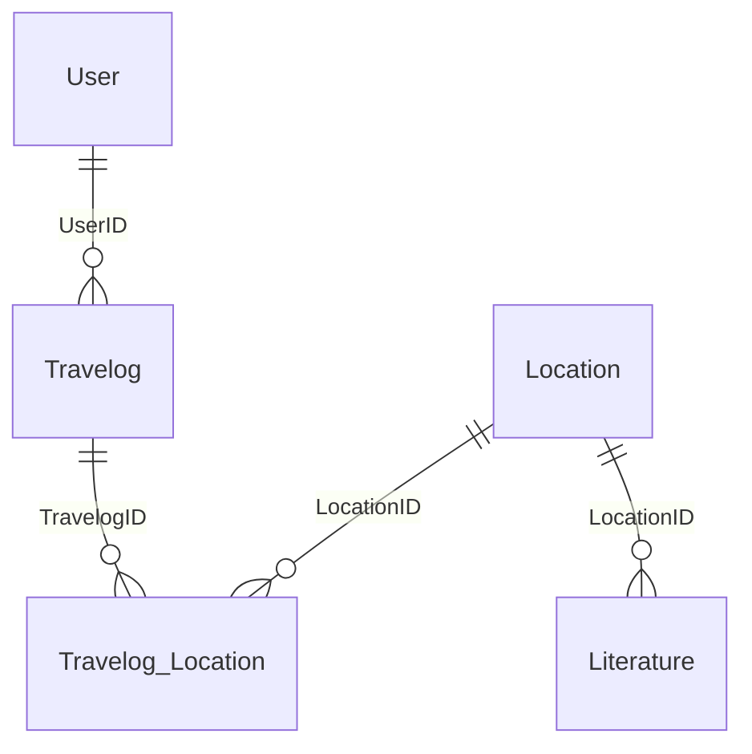

# 徐霞客时空游记系统 — 逻辑结构设计与范式分析

**文档编号**：03  
**版本**：V1.0  
**编写日期**：2026-05-26  
**前置文档**：`01_需求分析报告.md`、`02_概念结构设计.md`  
**项目名称**：徐霞客时空游记系统（Xu Xiake Spatiotemporal Travel Journal System）

---

## 1. E-R 图到关系模式的转换

### 1.1 转换规则（本系统适用）

| 规则编号 | E-R 结构 | 关系模式转换方法 |
| -------- | -------- | ---------------- |
| R-1 | 强实体 | 实体属性 → 关系属性；主属性 → 主键 |
| R-2 | 1 : n 联系 | 在 **n 端** 关系中加入 **1 端** 主键作为外键 |
| R-3 | m : n 联系 | 联系 **独立** 为关系；主键为两端实体主键之 **并集**；联系属性并入该关系 |
| R-4 | 关联实体 | 同 R-3；`Travelog_Location` 即 m : n 联系的对象化结果 |

### 1.2 转换结果一览

本系统共得到 **5 个关系模式**，与五个核心实体一一对应，无合并实体表（除按规则将外键并入 n 端外，无额外冗余关系）。

---

## 2. 关系模式定义

采用如下记法：**下划线** 表示主键，*斜体* 表示外键。

### 2.1 用户关系

```
User(<u>UserID</u>, Username, Password, AvatarPath, RegisterDate, Bio)
```

| 项目 | 说明 |
| ---- | ---- |
| 主键 PK | `UserID` |
| 候选键 | `Username`（唯一约束，登录用） |
| 外键 FK | 无 |

---

### 2.2 景点关系

```
Location(<u>LocationID</u>, LocName, Province, OpeningHours, IsXuXiake, Description)
```

| 项目 | 说明 |
| ---- | ---- |
| 主键 PK | `LocationID` |
| 外键 FK | 无 |

---

### 2.3 文献关系

```
Literature(<u>LitID</u>, <i>LocationID</i>, OriginalText, TranslateInfo, WriteDate)
```

| 项目 | 说明 |
| ---- | ---- |
| 主键 PK | `LitID` |
| 外键 FK | `LocationID` → `Location(LocationID)` |
| 参照联系 | Location — Literature（1 : n） |

---

### 2.4 游记关系

```
Travelog(<u>TravelogID</u>, <i>UserID</i>, Title, Content, PublishTime, Likes)
```

| 项目 | 说明 |
| ---- | ---- |
| 主键 PK | `TravelogID` |
| 外键 FK | `UserID` → `User(UserID)` |
| 参照联系 | User — Travelog（1 : n） |

---

### 2.5 游记景点打卡关系（桥表）

```
Travelog_Location(<u>TravelogID</u>, <u>LocationID</u>, CheckInTime)
```

| 项目 | 说明 |
| ---- | ---- |
| 主键 PK | **联合主键** `(TravelogID, LocationID)` |
| 外键 FK | `TravelogID` → `Travelog(TravelogID)`；`LocationID` → `Location(LocationID)` |
| 参照联系 | Travelog — Location（m : n，经拆解） |

---

### 2.6 全局关系模式图（Mermaid）



---

## 3. 函数依赖（FD）分析

为范式证明先给出各关系的 **最小函数依赖集**（记作 F）。

### 3.1 User

```
F_User:
  UserID   → Username, Password, AvatarPath, RegisterDate, Bio
  Username → UserID, Password, AvatarPath, RegisterDate, Bio   （由唯一约束，候选键）
```

- **主属性**：`{UserID}`
- **非主属性**：`Username, Password, AvatarPath, RegisterDate, Bio`
- 无非主属性对候选码的 **部分函数依赖**（单属性主键）。

### 3.2 Location

```
F_Location:
  LocationID → LocName, Province, OpeningHours, IsXuXiake, Description
```

- 单属性主键，结构同 User。

### 3.3 Literature

```
F_Literature:
  LitID → LocationID, OriginalText, TranslateInfo, WriteDate
```

- 单属性主键 `LitID`。
- `LocationID` 为外键，**不**出现在主键中，故不存在「主键真子集 → 非主属性」的 2NF 违例。

### 3.4 Travelog

```
F_Travelog:
  TravelogID → UserID, Title, Content, PublishTime, Likes
```

- 单属性主键；`UserID` 为外键，由 `TravelogID` 完全决定。

### 3.5 Travelog_Location

```
F_TL:
  (TravelogID, LocationID) → CheckInTime
```

- **联合主键**；唯一非主属性 `CheckInTime` 完全依赖于 **整个** 主键，而非 `TravelogID` 或 `LocationID` 之一。
- 直观含义：打卡时间由「哪篇游记 + 哪个景点」共同决定，不能仅由游记或仅由景点推出。

---

## 4. 数据库规范化理论分析

### 4.1 第一范式（1NF）

**定义**：关系模式中每一个属性都是 **不可再分** 的原子值；不存在重复组（多值属性在同一行反复出现）。

| 关系 | 1NF 论证 |
| ---- | -------- |
| User | 各字段均为标量：日期、字符串、数值，无「多个用户名」「多个密码」等同列多值 |
| Location | `OpeningHours` 以字符串存储时段描述，业务上视为原子（如「08:00—18:00」），不拆成多列重复组 |
| Literature | 原文、译注为 TEXT 原子字段，非「多条原文嵌在一格」 |
| Travelog | 标题、正文、时间、点赞均为原子；**未**将多个打卡景点压缩为 `LocationID` 列表或 JSON 数组（否则破坏 1NF） |
| Travelog_Location | 每行仅表示 **一个** 游记—景点配对及一个打卡时间，无同列多景点 |

**反例说明（未采用的设计）**：

若在 `Travelog` 中增加 `LocationList = "1,5,12"` 或 `CheckInTimes = "t1,t2,t3"`，则出现 **多值属性 / 重复组**，违反 1NF，且无法对单景点打卡建立外键与约束。

**结论**：五张表均满足 **1NF**。

---

### 4.2 第二范式（2NF）

**定义**：满足 1NF，且每个非主属性 **完全函数依赖于候选码**（不存在对候选码真子集的部分函数依赖）。

仅当候选码为 **复合主键** 时，才需重点检查 2NF；本系统仅 `Travelog_Location` 为联合主键。

| 关系 | 候选码 | 2NF 论证 |
| ---- | ------ | -------- |
| User | `{UserID}` | 单属性码，无真子集 → **平凡满足 2NF** |
| Location | `{LocationID}` | 同上 |
| Literature | `{LitID}` | 同上；不存在 `LitID` 的真子集决定 `OriginalText` 等情况 |
| Travelog | `{TravelogID}` | 同上 |
| Travelog_Location | `{TravelogID, LocationID}` | 仅非主属性 `CheckInTime`；需证 **不存在** `TravelogID → CheckInTime` 或 `LocationID → CheckInTime`。业务上：一篇游记在不同景点打卡时间不同；同一景点在不同游记中打卡时间不同 → `CheckInTime` 仅由 **完整联合键** 决定 → **满足 2NF** |

**若违反 2NF 的假想**：将 `LocName, Province` 等与 `LocationID` 一起写入 `Travelog_Location`，则会出现 `LocationID → LocName, Province`（部分依赖联合键的真子集），产生传递冗余 — 本设计 **未** 如此做，景点描述保留在 `Location` 中。

**结论**：五张表均满足 **2NF**。

---

### 4.3 第三范式（3NF）

**定义**：满足 2NF，且每个非主属性 **不传递依赖于候选码**（不存在非主属性 A → 非主属性 B，其中 A 不是候选码）。

| 关系 | 3NF 论证 |
| ---- | -------- |
| User | 所有非主属性直接依赖于 `UserID`；`Username` 为候选键，与 `UserID` 一一对应，无「UserID → X → Y」传递链 |
| Location | 非主属性均直接依赖于 `LocationID` |
| Literature | `LitID → LocationID, OriginalText, ...`；`LocationID` 为外键引用，**不是** 由 `LitID` 经其他非主属性间接推出；景点名等不冗余存储在 Literature |
| Travelog | `TravelogID` 直接决定 `UserID, Title, ...`；用户名、头像等 **不** 冗余存入游记（避免 `TravelogID → UserID → Username` 的传递依赖） |
| Travelog_Location | 仅 `CheckInTime` 一个非主属性，完全依赖联合主键，无第三属性可形成传递链 |

**传递依赖反例（已消除）**：

- 若 `Travelog` 含 `Username`：则 `TravelogID → UserID → Username`，`Username` 传递依赖于 `TravelogID`，且用户改名时需改所有游记行 → **违反 3NF**。当前设计将用户资料仅存于 `User`。
- 若 `Literature` 含 `LocName`：则 `LitID → LocationID → LocName`，**违反 3NF**。当前设计通过 `LocationID` 外键关联查询。

**结论**：五张表均满足 **3NF**。

---

### 4.4 范式层次汇总

| 关系 | 1NF | 2NF | 3NF | 说明 |
| ---- | --- | --- | --- | ---- |
| User | ✓ | ✓ | ✓ | 单主键，无冗余传递 |
| Location | ✓ | ✓ | ✓ | 单主键 |
| Literature | ✓ | ✓ | ✓ | 外键不引入传递冗余 |
| Travelog | ✓ | ✓ | ✓ | 用户属性不嵌入 |
| Travelog_Location | ✓ | ✓ | ✓ | 联系属性仅依赖联合键 |

**整体结论**：本逻辑模式至少达到 **3NF**，满足高校数据库课程对规范化设计的要求。各关系候选码均为 **主属性** 集合，亦符合 **BCNF** 的常见情形（单主键表 trivially in BCNF；桥表仅一个非主属性且完全依赖联合键，亦满足 BCNF）。

---

## 5. 异常分析与消除（高分要点）

以下对比 **非规范化 / 大表合并** 方案与本 **3NF 五表方案**，说明插入、删除、修改异常及冗余如何被消除。

### 5.1 游记—景点 m : n 合并反例

**反模式**：单表 `Travelog_All(TravelogID, UserID, Title, ..., LocationID, LocName, Province, CheckInTime)`，一行仅记录一个打卡，但游记字段重复。

| 异常类型 | 反模式下的问题 | 本设计如何消除 |
| -------- | -------------- | -------------- |
| **插入异常** | 想先登记「黄山」景点但尚无游记 → 若景点信息绑在游记行上，可能无法插入 | `Location` 独立存在，可先插入景点、文献，与游记无关 |
| **插入异常** | 用户注册后尚未发游记 → 无法写入含 `TravelogID` 的宽表 | `User` 独立；游记写入 `Travelog` 即可 |
| **删除异常** | 删除某篇游记最后一行打卡时，若宽表还承担「景点唯一描述」→ 可能误删景点信息 | 删 `Travelog` 仅级联 `Travelog_Location`；`Location` 保留 |
| **删除异常** | 删除用户唯一游记时连带丢失用户账号信息（若混表） | `User` 与 `Travelog` 分离，删游记不影响用户实体 |
| **修改异常** | 某景点 `Province` 更正，需更新所有含该景点的打卡/游记行 | 仅在 `Location` 改一行，通过 `LocationID` 关联自动一致 |
| **修改异常** | 用户改 `Username`，需改所有游记副本 | 只改 `User` 一行 |
| **数据冗余** | 同一游记 N 个景点 → 标题、正文、UserID 重复 N 遍 | 游记属性只在 `Travelog` 存一份；桥表仅 `(TravelogID, LocationID, CheckInTime)` |
| **数据冗余** | 同一景点 M 篇游记 → 景点名、省份重复 M 遍 | 景点属性只在 `Location` 存一份 |

### 5.2 文献—景点 1 : n

| 异常类型 | 消除方式 |
| -------- | -------- |
| 插入异常 | 可单独新增 `Location`，再增 `Literature`；无需先有游记 |
| 删除异常 | 删除某条文献不影响景点与其他文献（级联策略在物理层配置为删景点才删文献） |
| 修改异常 | 文献译注变更只改 `Literature` 一行 |
| 冗余 | 不在 `Location` 中重复存储多篇文献正文 |

### 5.3 用户—游记 1 : n

| 异常类型 | 消除方式 |
| -------- | -------- |
| 插入异常 | 用户可先注册（`User`），后发游记（`Travelog`） |
| 删除异常 | 删除游记（`ON DELETE CASCADE`）不删除用户；删除用户时级联游记由物理设计保证一致性 |
| 冗余 | 用户 Bio、Avatar 不复制到每篇游记 |

### 5.4 桥表 Travelog_Location 的设计价值

将 **CheckInTime** 置于桥表，使得：

1. **m : n** 语义完整：行数 = 打卡次数，可 ≥ 10,000 条测试数据；
2. 联合主键防止同一游记对同一景点重复打卡；
3. 避免在 `Travelog` 或 `Location` 引入多值字段，从根上满足 **1NF**；
4. 非主属性 `CheckInTime` 对联合键 **完全依赖**，满足 **2NF**；
5. 不混入景点名、游记标题，满足 **3NF**，消除传递冗余。

---

## 6. 参照完整性约束汇总

| 子关系 | 外键 | 父关系 | 删除语义（物理层） |
| ------ | ---- | ------ | ------------------ |
| Literature | LocationID | Location | CASCADE |
| Travelog | UserID | User | CASCADE |
| Travelog_Location | TravelogID | Travelog | CASCADE |
| Travelog_Location | LocationID | Location | CASCADE |

**语义**：删除用户 → 其名下游记及打卡记录清除；删除游记 → 其打卡记录清除；删除景点 → 其文献及被打卡记录清除。父实体独立存在性由分离的关系保证。

---

## 7. 逻辑设计验证（无损连接与依赖保持）

| 分解关系组 | 说明 |
| ---------- | ---- |
| {User, Travelog} | 1 : n 联系通过 `Travelog.UserID` 外键保持，无损失 |
| {Location, Literature} | 1 : n 通过 `Literature.LocationID` 保持 |
| {Travelog, Location, Travelog_Location} | m : n 通过桥表 **无损** 连接；可由 `Travelog_Location` ⋈ `Travelog` ⋈ `Location` 还原全部打卡事实 |
| 依赖保持 | 各关系 F 在对应模式内成立，无跨表传递决定非主属性 |

---

## 8. 逻辑设计小结

1. **五个关系模式** 完整覆盖需求实体，主键、外键标注清晰；
2. **1NF**：杜绝多值属性与重复组，游记—景点 m : n 由桥表行展开；
3. **2NF**：无部分函数依赖；桥表 `CheckInTime` 完全依赖 `(TravelogID, LocationID)`；
4. **3NF**：无传递依赖；用户、景点描述不冗余嵌入从表；
5. **异常**：插入、删除、修改异常通过 **实体分离 + 外键关联** 系统性消除。

下一步将在 `04_物理设计与建表语句.sql` 中落实 MySQL 8.0+ DDL、级联删除与查询优化索引。

---

**文档状态**：初稿完成，待评审确认后进入「04 物理结构设计与 MySQL DDL」阶段。
